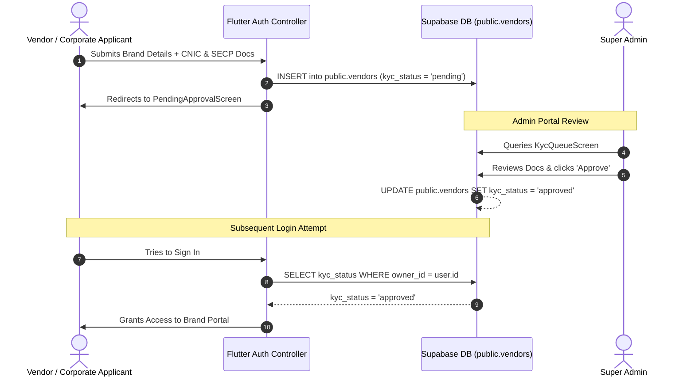

# Application & Database Login Policies (Supabase Auth & RLS Blueprint)

This document contains the complete technical specification, policy names, and a **single one-click copy-paste SQL deployment script** for **Supabase Auth, Row Level Security (RLS), Storage Policies, Vendor KYC Verification, and Flutter Application Access Control** for the **Velvet Maison E-Commerce Platform** (`ecom_app`).

---

## 1. Single All-in-One Copy & Paste Supabase SQL Script

Copy the entire single code block below, go to your **Supabase Dashboard -> SQL Editor -> New Query**, paste it, and click **RUN**. It creates both tables (`profiles`, `vendors`), database triggers, storage buckets, and all RLS security policies in one execution.

```sql
-- ============================================================================
-- VELVET MAISON E-COMMERCE PLATFORM: COMPLETE ALL-IN-ONE SUPABASE SETUP SCRIPT
-- ============================================================================

-- ----------------------------------------------------------------------------
-- STEP 1: CREATE DATABASE TABLES
-- ----------------------------------------------------------------------------

-- Table 1: Profiles Table (Stores user profile & body metrics)
CREATE TABLE IF NOT EXISTS public.profiles (
  id UUID PRIMARY KEY REFERENCES auth.users(id) ON DELETE CASCADE,
  full_name TEXT NOT NULL DEFAULT 'User',
  role TEXT NOT NULL DEFAULT 'shopper', -- Options: 'shopper' | 'vendor' | 'corporate' | 'admin'
  vendor_id UUID NULL,
  phone TEXT NULL,
  email TEXT NULL,
  height NUMERIC NULL,
  weight NUMERIC NULL,
  fit_preference TEXT NULL,
  shopping_categories TEXT[] NULL,
  avatar_url TEXT NULL,
  created_at TIMESTAMPTZ DEFAULT NOW(),
  updated_at TIMESTAMPTZ DEFAULT NOW()
);

-- Table 2: Vendors Table (Stores Vendor & Corporate KYC Application Data)
CREATE TABLE IF NOT EXISTS public.vendors (
  id UUID PRIMARY KEY DEFAULT gen_random_uuid(),
  brand_name TEXT NOT NULL,
  owner_id UUID NOT NULL REFERENCES auth.users(id) ON DELETE CASCADE,
  kyc_status TEXT NOT NULL DEFAULT 'pending', -- Options: 'pending' | 'approved' | 'rejected'
  cnic_doc_url TEXT NULL,
  secp_doc_url TEXT NULL,
  bio TEXT NULL,
  city TEXT NULL,
  category TEXT NULL,
  created_at TIMESTAMPTZ DEFAULT NOW(),
  updated_at TIMESTAMPTZ DEFAULT NOW()
);

-- ----------------------------------------------------------------------------
-- STEP 2: AUTOMATIC PROFILE SYNCHRONIZATION TRIGGER
-- ----------------------------------------------------------------------------

CREATE OR REPLACE FUNCTION public.handle_new_user()
RETURNS TRIGGER
LANGUAGE plpgsql
SECURITY DEFINER SET search_path = public
AS $$
BEGIN
  INSERT INTO public.profiles (id, full_name, role, email, phone)
  VALUES (
    NEW.id,
    COALESCE(NEW.raw_user_meta_data->>'full_name', 'User'),
    COALESCE(NEW.raw_user_meta_data->>'role', 'shopper'),
    NEW.email,
    COALESCE(NEW.raw_user_meta_data->>'phone', NEW.phone)
  )
  ON CONFLICT (id) DO UPDATE
  SET
    full_name = EXCLUDED.full_name,
    role = EXCLUDED.role,
    email = EXCLUDED.email,
    phone = EXCLUDED.phone,
    updated_at = NOW();
  RETURN NEW;
EXCEPTION WHEN OTHERS THEN
  RETURN NEW;
END;
$$;

DROP TRIGGER IF EXISTS on_auth_user_created ON auth.users;
CREATE TRIGGER on_auth_user_created
  AFTER INSERT ON auth.users
  FOR EACH ROW EXECUTE FUNCTION public.handle_new_user();

-- ----------------------------------------------------------------------------
-- STEP 3: ROW LEVEL SECURITY (RLS) POLICIES FOR PROFILES (NON-RECURSIVE)
-- ----------------------------------------------------------------------------

ALTER TABLE public.profiles ENABLE ROW LEVEL SECURITY;

DROP POLICY IF EXISTS "profiles_select_owner_or_admin" ON public.profiles;
CREATE POLICY "profiles_select_owner_or_admin"
ON public.profiles FOR SELECT
TO authenticated, anon
USING (
  auth.uid() = id
  OR ((auth.jwt() -> 'user_metadata') ->> 'role') = 'admin'
);

DROP POLICY IF EXISTS "profiles_insert_self" ON public.profiles;
CREATE POLICY "profiles_insert_self"
ON public.profiles FOR INSERT
TO authenticated
WITH CHECK (auth.uid() = id);

DROP POLICY IF EXISTS "profiles_update_self" ON public.profiles;
CREATE POLICY "profiles_update_self"
ON public.profiles FOR UPDATE
TO authenticated
USING (auth.uid() = id)
WITH CHECK (auth.uid() = id);

DROP POLICY IF EXISTS "profiles_delete_admin_only" ON public.profiles;
CREATE POLICY "profiles_delete_admin_only"
ON public.profiles FOR DELETE
TO authenticated
USING (((auth.jwt() -> 'user_metadata') ->> 'role') = 'admin');

-- ----------------------------------------------------------------------------
-- STEP 4: ROW LEVEL SECURITY (RLS) POLICIES FOR VENDORS (KYC ENFORCEMENT)
-- ----------------------------------------------------------------------------

ALTER TABLE public.vendors ENABLE ROW LEVEL SECURITY;

DROP POLICY IF EXISTS "vendors_select_approved_owner_or_admin" ON public.vendors;
CREATE POLICY "vendors_select_approved_owner_or_admin"
ON public.vendors FOR SELECT
TO authenticated, anon
USING (
  kyc_status = 'approved'
  OR auth.uid() = owner_id
  OR ((auth.jwt() -> 'user_metadata') ->> 'role') = 'admin'
);

DROP POLICY IF EXISTS "vendors_insert_authenticated" ON public.vendors;
CREATE POLICY "vendors_insert_authenticated"
ON public.vendors FOR INSERT
TO authenticated
WITH CHECK (auth.uid() = owner_id);

DROP POLICY IF EXISTS "vendors_update_admin_or_owner" ON public.vendors;
CREATE POLICY "vendors_update_admin_or_owner"
ON public.vendors FOR UPDATE
TO authenticated
USING (
  auth.uid() = owner_id
  OR ((auth.jwt() -> 'user_metadata') ->> 'role') = 'admin'
);

DROP POLICY IF EXISTS "vendors_delete_admin_only" ON public.vendors;
CREATE POLICY "vendors_delete_admin_only"
ON public.vendors FOR DELETE
TO authenticated
USING (((auth.jwt() -> 'user_metadata') ->> 'role') = 'admin');

-- ----------------------------------------------------------------------------
-- STEP 5: SUPABASE STORAGE BUCKETS & STORAGE RLS POLICIES
-- ----------------------------------------------------------------------------

INSERT INTO storage.buckets (id, name, public)
VALUES ('avatars', 'avatars', true)
ON CONFLICT (id) DO NOTHING;

INSERT INTO storage.buckets (id, name, public)
VALUES ('rma-evidence', 'rma-evidence', false)
ON CONFLICT (id) DO NOTHING;

DROP POLICY IF EXISTS "storage_avatars_select_public" ON storage.objects;
CREATE POLICY "storage_avatars_select_public"
ON storage.objects FOR SELECT
TO public
USING (bucket_id = 'avatars');

DROP POLICY IF EXISTS "storage_avatars_insert_authenticated_user" ON storage.objects;
CREATE POLICY "storage_avatars_insert_authenticated_user"
ON storage.objects FOR INSERT
TO authenticated
WITH CHECK (
  bucket_id = 'avatars'
  AND (storage.foldername(name))[1] = auth.uid()::text
);

DROP POLICY IF EXISTS "storage_avatars_update_owner" ON storage.objects;
CREATE POLICY "storage_avatars_update_owner"
ON storage.objects FOR UPDATE
TO authenticated
USING (
  bucket_id = 'avatars'
  AND (storage.foldername(name))[1] = auth.uid()::text
);

DROP POLICY IF EXISTS "storage_rma_select_authenticated" ON storage.objects;
CREATE POLICY "storage_rma_select_authenticated"
ON storage.objects FOR SELECT
TO authenticated
USING (bucket_id = 'rma-evidence');

DROP POLICY IF EXISTS "storage_rma_insert_authenticated" ON storage.objects;
CREATE POLICY "storage_rma_insert_authenticated"
ON storage.objects FOR INSERT
TO authenticated
WITH CHECK (bucket_id = 'rma-evidence');
```

---

## 2. Policy-to-Code Mapping Matrix

| Target Table / Bucket | Exact SQL Policy Name | Operation | Flutter Code Implementation & Method |
| :--- | :--- | :--- | :--- |
| `public.profiles` | `profiles_select_owner_or_admin` | `SELECT` | [AuthRepositoryImpl.getProfile()](file:///d:/Projects/ecom_app/lib/features/auth/data/repositories/auth_repository_impl.dart#L17) |
| `public.profiles` | `profiles_insert_self` | `INSERT` / `UPSERT` | [AuthRepositoryImpl.createProfile()](file:///d:/Projects/ecom_app/lib/features/auth/data/repositories/auth_repository_impl.dart#L156) |
| `public.profiles` | `profiles_update_self` | `UPDATE` | [AuthRepositoryImpl.updateProfileDetails()](file:///d:/Projects/ecom_app/lib/features/auth/data/repositories/auth_repository_impl.dart#L260) & [updateBodyMetrics()](file:///d:/Projects/ecom_app/lib/features/auth/data/repositories/auth_repository_impl.dart#L225) |
| `public.profiles` | `profiles_delete_admin_only` | `DELETE` | Initiated via Super Admin User Management Portal |
| `public.vendors` (KYC) | `vendors_select_approved_owner_or_admin` | `SELECT` | [AuthController.signInVendor()](file:///d:/Projects/ecom_app/lib/features/auth/controllers/auth_controller.dart#L389) & [signInCorporate()](file:///d:/Projects/ecom_app/lib/features/auth/controllers/auth_controller.dart#L521) |
| `public.vendors` (KYC) | `vendors_insert_authenticated` | `INSERT` | [AuthRepositoryImpl.createVendor()](file:///d:/Projects/ecom_app/lib/features/auth/data/repositories/auth_repository_impl.dart#L187) |
| `public.vendors` (KYC) | `vendors_update_admin_or_owner` | `UPDATE` | Admin KYC Approval Workflow (`AdminCrudController`) |
| `storage.objects` (`avatars`) | `storage_avatars_select_public` | `SELECT` | `SupabaseStorage.getPublicUrl()` in [AuthRepositoryImpl.uploadAvatar()](file:///d:/Projects/ecom_app/lib/features/auth/data/repositories/auth_repository_impl.dart#L300) |
| `storage.objects` (`avatars`) | `storage_avatars_insert_authenticated_user` | `INSERT` | [AuthRepositoryImpl.uploadAvatar()](file:///d:/Projects/ecom_app/lib/features/auth/data/repositories/auth_repository_impl.dart#L308) |
| `storage.objects` (`rma-evidence`) | `storage_rma_insert_authenticated` | `INSERT` | Fallback avatar & RMA file upload mechanism |

---

## 3. Dedicated Vendor KYC & Verification Specification

### 3.1 Verification Artifacts
1. **CNIC Document (`cnic_doc_url`)**: National Identity Card image or PDF.
2. **SECP Certificate (`secp_doc_url`)**: Securities and Exchange Commission business registration.
3. **NTN Number (`bio` / Metadata)**: National Tax Number for corporate buyers and brands.

### 3.2 Vendor KYC Lifecycle & Gatekeeping Sequence



---

## 4. How to Execute in Supabase

1. Open **Supabase Dashboard** -> Select your Project (`https://supabase.com/dashboard`).
2. Click **SQL Editor** in the left menu.
3. Click **+ New Query**.
4. Copy the entire SQL script block from **Section 1** above and paste it directly into the SQL Editor.
5. Click **RUN** (or press `Ctrl + Enter`).
6. Navigate to **Table Editor** to view your newly created `profiles` and `vendors` tables.

---
*Document Version: 4.2 (Fixed Infinite Recursion Error in RLS Policies)*
